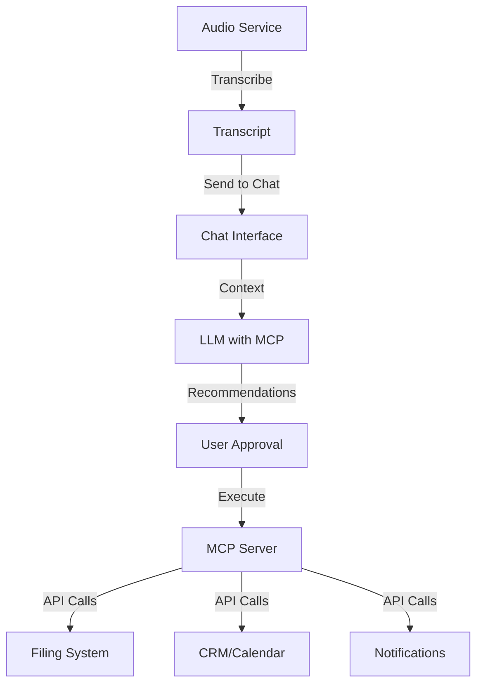

# Roadmap Update: Audio Integration & MCP Features

## 🎯 New Features to Add

### Phase 3.5: Audio-Chat Integration (Q3 2025)

#### Audio Transcription to Chat Pipeline
**Goal**: Seamlessly feed transcribed audio into the chat interface for interactive Q&A

**Features**:
1. **Direct Transcription Transfer**
   - "Send to Chat" button in audio interface
   - Automatic context injection into chat session
   - Preserve speaker identification (if multi-speaker)
   - Timestamp references for long recordings

2. **Transcript-Aware Chat**
   - Chat understands it's discussing a transcript
   - Can reference specific timestamps
   - Summarization with time markers
   - Extract action items from meetings
   - Generate meeting minutes

3. **Interactive Transcript Analysis**
   - "Ask about this segment" - highlight and query
   - Real-time Q&A during playback
   - Generate FAQ from transcript
   - Sentiment analysis per segment

**Implementation**:
```javascript
// Example API flow
POST /api/v1/audio/transcribe
  -> GET /api/v1/audio/transcript/{id}
  -> POST /api/v1/chat/inject-context
  -> Interactive Q&A session
```

### Phase 4.5: MCP Integration (Q4 2025)

#### Model Context Protocol for Enterprise Integration
**Goal**: Enable LLM to recommend and execute API calls for document management

**Features**:
1. **MCP Server Implementation**
   - Define available tools/APIs
   - Authentication & authorization
   - Rate limiting & quotas
   - Audit logging

2. **Smart API Recommendations**
   ```
   User: "File this transcript in the HR folder"
   LLM: "I'll help you file this transcript. Let me:
         1. [CALL: mcp://filing/create-document]
         2. [CALL: mcp://filing/add-metadata]
         3. [CALL: mcp://filing/move-to-folder]
         Would you like me to proceed?"
   ```

3. **Available MCP Tools**:
   - **Filing System**
     - `filing/create-document` - Create new document
     - `filing/add-metadata` - Add tags, categories
     - `filing/move-to-folder` - Organize documents
     - `filing/set-permissions` - Access control
   
   - **Notification System**
     - `notify/send-email` - Email summaries
     - `notify/create-task` - Create follow-up tasks
     - `notify/schedule-reminder` - Set reminders
   
   - **Integration APIs**
     - `crm/create-contact` - Add contacts from calls
     - `calendar/create-event` - Schedule from transcript
     - `slack/post-summary` - Share to channels

4. **Intelligent Suggestions**
   - Auto-detect document type (meeting, interview, lecture)
   - Suggest appropriate filing location
   - Recommend metadata tags
   - Propose follow-up actions

**Example Workflow**:
```yaml
1. User uploads audio file
2. System transcribes audio
3. User clicks "Process with AI"
4. Chat interface opens with transcript context
5. LLM analyzes and suggests:
   - "This appears to be a client meeting from [DATE]"
   - "Suggested actions:
     • File under 'Client Meetings/[CLIENT_NAME]'
     • Extract action items (found 3)
     • Send summary to participants
     • Create follow-up tasks in project management"
6. User approves with single click
7. MCP executes all API calls
8. Confirmation with links to filed documents
```

### Implementation Architecture



### Technical Requirements

1. **Database Schema Updates**
   ```sql
   -- Transcript storage
   CREATE TABLE transcripts (
     id UUID PRIMARY KEY,
     audio_file_id UUID,
     content TEXT,
     metadata JSONB,
     created_at TIMESTAMP
   );
   
   -- MCP execution log
   CREATE TABLE mcp_executions (
     id UUID PRIMARY KEY,
     transcript_id UUID,
     tool_calls JSONB,
     status VARCHAR(50),
     executed_at TIMESTAMP
   );
   ```

2. **API Endpoints**
   ```
   POST /api/v1/transcript/to-chat
   POST /api/v1/mcp/recommend
   POST /api/v1/mcp/execute
   GET  /api/v1/mcp/tools
   ```

3. **Security Considerations**
   - MCP tool permissions per user/role
   - Approval workflow for sensitive operations
   - Audit trail for all MCP executions
   - Sandboxed execution environment

### Benefits

1. **Productivity Gains**
   - Reduce manual filing time by 80%
   - Automatic meeting minutes generation
   - Never miss action items

2. **Compliance & Governance**
   - Automatic document classification
   - Retention policy enforcement
   - Audit trail for all operations

3. **Integration Value**
   - Connect to existing enterprise systems
   - No need to switch between applications
   - Centralized document intelligence

### Development Phases

**Phase 1: Basic Integration (2 weeks)**
- Audio to chat transfer
- Basic transcript Q&A

**Phase 2: Smart Analysis (3 weeks)**
- Meeting minutes generation
- Action item extraction
- Timestamp navigation

**Phase 3: MCP Foundation (4 weeks)**
- MCP server setup
- Basic tool definitions
- Security framework

**Phase 4: Enterprise Tools (4 weeks)**
- Filing system integration
- CRM/Calendar connectors
- Notification system

**Phase 5: Intelligence Layer (3 weeks)**
- Auto-categorization
- Smart recommendations
- Batch operations

### Success Metrics

- **User Efficiency**: Time saved per transcript (target: 15 min → 2 min)
- **Accuracy**: Correct filing location (target: >95%)
- **Adoption**: % of transcripts processed via MCP (target: >80%)
- **Error Rate**: Failed MCP executions (target: <1%)

## Integration with Existing Roadmap

This fits perfectly between Phase 3 (Advanced Features) and Phase 4 (Scale & Optimization), adding:
- Enhanced user workflow automation
- Enterprise-ready document management
- Seamless multi-service integration

The MCP integration also prepares for Phase 5's third-party integrations by establishing the protocol layer.