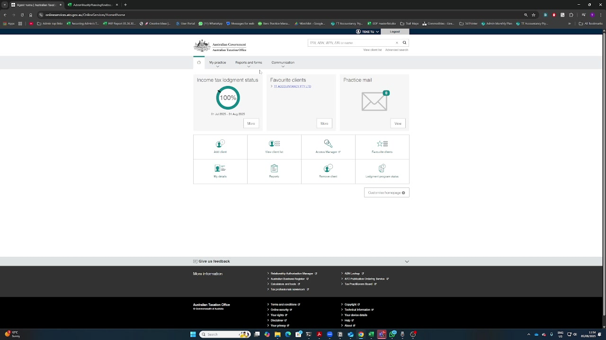
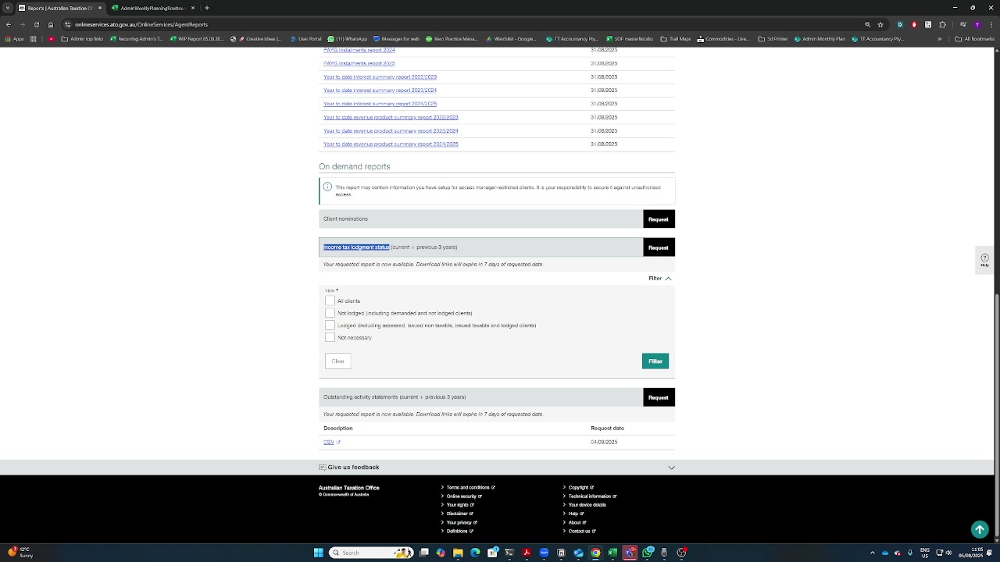
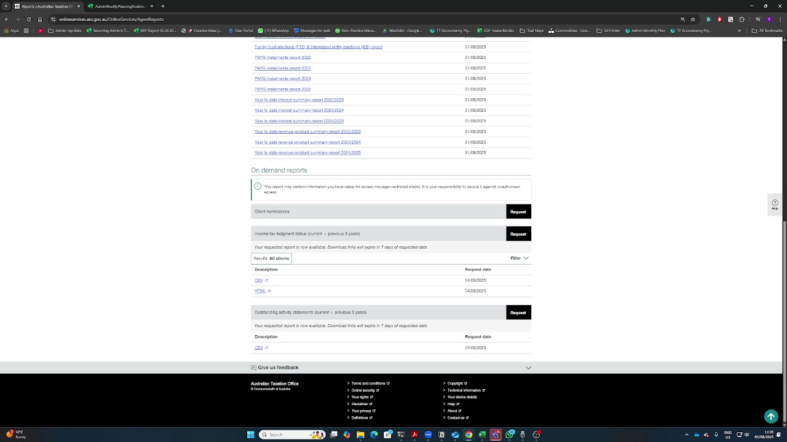

# How to Retrieve ATO Reports After Request Processing

*Generated from: 2025-09-05 11-04-15.mkv*  
*Date: 2025-09-08 14:16*  
*Duration: 1 minute 20 seconds*

## Overview
This SOP documents the process of retrieving reports from the ATO (Australian Tax Office) portal after submitting requests. This covers checking the status of previously submitted requests and downloading the available reports.

## Prerequisites
- [ ] ATO portal access credentials
- [ ] Previous request submitted (typically takes 1 business day to process)
- [ ] Web browser with stable internet connection

## Context
After submitting requests to the ATO (such as tax written status or login steps), reports typically become available the next business day. This guide shows how to retrieve those processed reports.

## Steps

### Step 1: Access the ATO Portal
*Timestamp: 00:00 - 00:10*

**Action:** Navigate to the ATO portal login page

**Instructions:**
1. Open your web browser
2. Navigate to the ATO portal URL
3. Enter your credentials if not already logged in

**Visual:** The ATO portal main dashboard showing various tiles and options for accessing different functions.

---

### Step 2: Navigate to Reports Section
*Timestamp: 00:10 - 00:20*

**Action:** Access the reports area from the main menu

**Instructions:**
1. From the main portal page, locate the "Reports" menu option
2. Click on "Reports" to access the reporting section

**Visual:** The Reports section of the ATO portal showing available report options.

---

### Step 3: Locate Status Reports
*Timestamp: 00:20 - 00:35*

**Action:** Find the specific status reports in the reports section

**Instructions:**
1. Scroll down in the reports section
2. Look for the following report types:
   - Income Tax Status Report
   - Large Amount Status Report
   - Outstanding Activity Status Report

**Note:** These reports may not be immediately available after submission. Typically available the next business day.

**Visual:** The Reports page displaying Income Tax Lodgment Status and other status report options that are now available for download.

---

### Step 4: Select Client Filter
*Timestamp: 00:35 - 00:50*

**Action:** Configure the client selection filter

**Instructions:**
1. Locate the client selection dropdown/filter
2. Select "All Clients" option
3. Apply the filter to show reports for all clients

**Visual:** The Income Tax Lodgment Status report page with the "All clients" filter option visible at the bottom of the screen.

---

### Step 5: Verify CSV Availability
*Timestamp: 00:50 - 01:00*

**Action:** Check that CSV download option is available

**Instructions:**
1. After applying filters, verify that the CSV download option appears
2. The CSV option indicates the report is ready for download

**Visual:** The report results showing data for multiple years with CSV and XML download options clearly visible.

---

### Step 6: Download Reports
*Timestamp: 01:00 - 01:10*

**Action:** Download the report files

**Instructions:**
1. Click on the CSV download option
2. Choose your download location if prompted
3. Wait for the download to complete
4. Verify the file has been downloaded successfully

**Visual:** The report page with CSV and XML download buttons prominently displayed, ready for downloading the report data.

---

## Summary

This process allows you to retrieve reports from the ATO portal that were requested previously. The key points are:

✅ Reports typically become available the next business day  
✅ Navigate to ATO Portal → Reports → Status Reports  
✅ Select "All Clients" filter  
✅ Download available CSV files  

## Important Notes

- **Processing Time:** Reports requested yesterday typically become available today (next business day)
- **Report Types Available:**
  - Income Tax Status Report
  - Large Amount Status Report
  - Outstanding Activity Status Report
- **Format:** Reports are available in CSV format for easy processing
- **Filter:** Always select "All Clients" to ensure you see all available reports

## Troubleshooting

**Issue:** Reports not showing after 1 business day
- **Solution:** Check if the request was submitted successfully; contact ATO support if delays persist

**Issue:** Cannot access Reports section
- **Solution:** Verify your account has the necessary permissions; check with your administrator

**Issue:** CSV download fails
- **Solution:** Check browser download settings; try a different browser if issue persists

## Related Procedures
- Submitting initial ATO requests
- Processing downloaded CSV files
- Updating client records with retrieved information

---

*This SOP was generated from a screen recording demonstrating the actual process. The video showed the complete workflow from login to successful file download.*