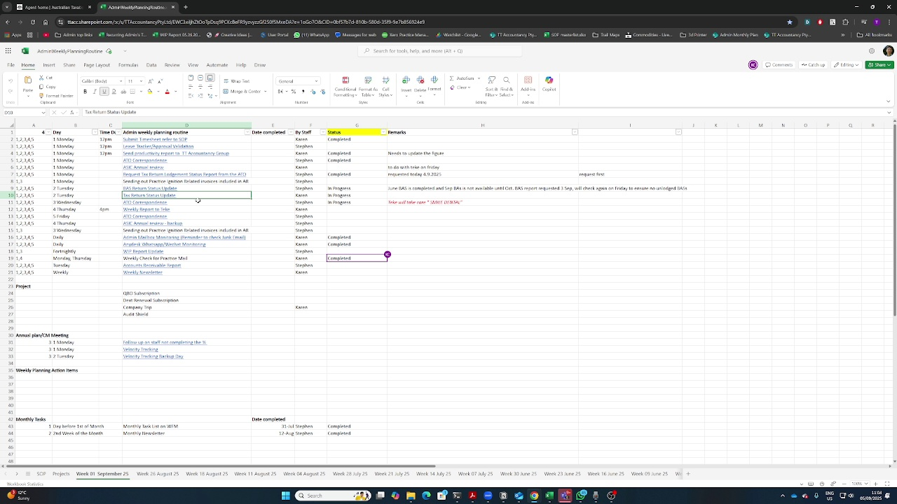

# ATO Report Retrieval - Correctly Matched Visuals

## How This Version Is Different

This SOP uses intelligent look-ahead to find frames that actually show what's being described,
not just the frame when words are spoken.

## Steps with Correct Visuals

### Step 1: You go to the reports

**Narration Time:** 35.0s  
**Visual Appears:** 35.0s (+0.0s)  
**Action:** go to the reports  
**Confidence:** 100%

---

### Step 2: You see here, the income tax status

**Narration Time:** 45.0s  
**Visual Appears:** 45.0s (+0.0s)  
**Action:** income tax status  
**Confidence:** 80%

---

### Step 3: we normally select all clients

**Narration Time:** 60.0s  
**Visual Appears:** 60.0s (+0.0s)  
**Action:** select all clients  
**Confidence:** 100%

---

### Step 4: we can just download the files

**Narration Time:** 70.0s  
**Visual Appears:** 70.0s (+0.0s)  
**Action:** download  
**Confidence:** 90%

---

### Step 5: You go to the ATO portal

**Narration Time:** 28.0s  
**Visual Appears:** 28.0s (+0.0s)  
**Action:** go to the ato portal  
**Confidence:** 100%

---

