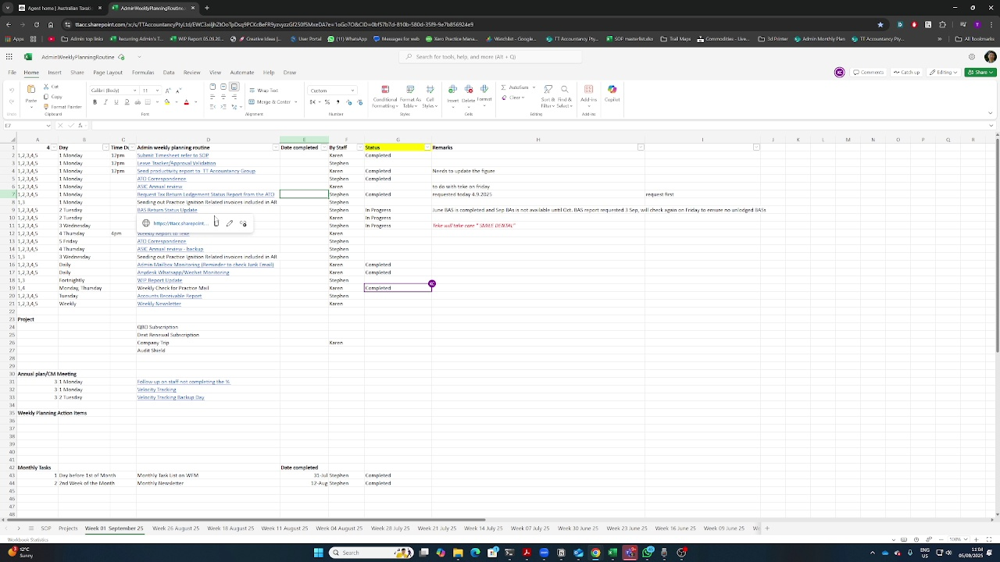
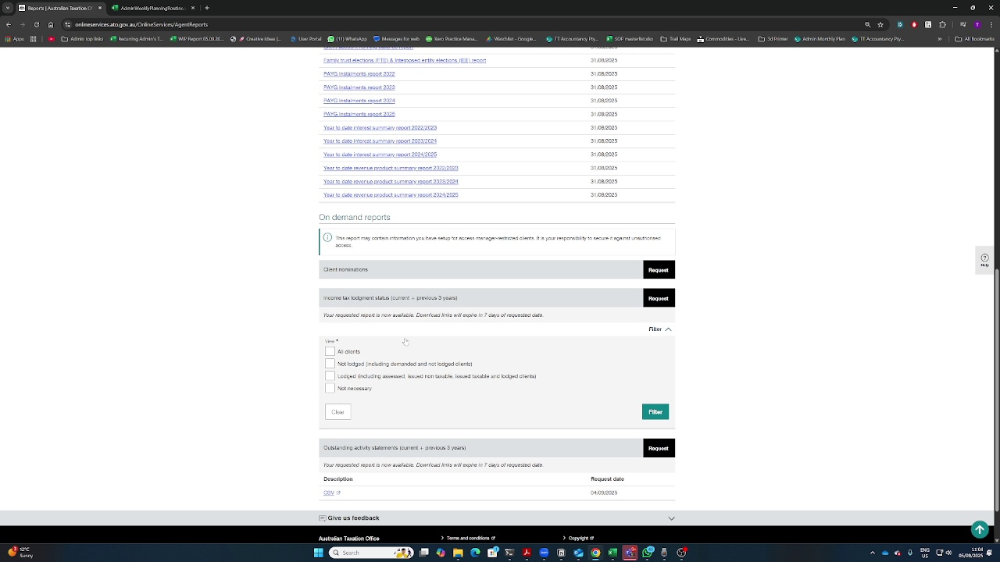
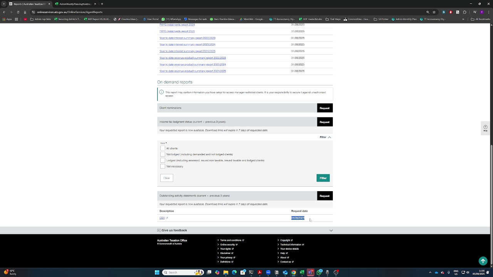
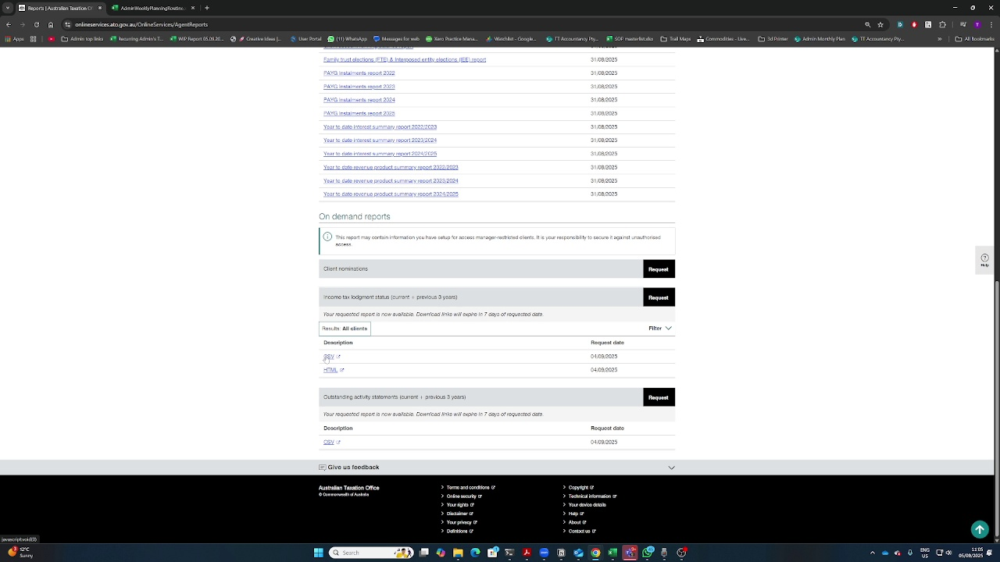

# How to Retrieve ATO Reports - Comprehensive Guide

*Generated from: 2025-09-05 11-04-15*  
*Date: 2025-09-08 16:42*  
*System: Hybrid VLM + Claude Documentation*

## Overview

This Standard Operating Procedure (SOP) provides detailed instructions for retrieving reports from the Australian Taxation Office (ATO) portal. The process covers accessing previously requested reports that have been processed and are ready for download.

### Intelligence Behind This SOP

This document was created using a hybrid approach:
- **Visual Verification**: Qwen2.5-VL-7B model verified each frame matches the described action
- **Documentation Expertise**: Claude AI enhanced with comprehensive instructions, tips, and warnings
- **Temporal Analysis**: Automatic detection of visual delays relative to narration

## Prerequisites

Before beginning this process, ensure you have:

- [ ] Valid ATO portal credentials (myGovID)
- [ ] Appropriate permissions to access client reports
- [ ] Previously submitted report requests (allow 1 business day for processing)
- [ ] Stable internet connection
- [ ] Compatible web browser (Chrome, Edge, or Firefox recommended)
- [ ] Sufficient disk space for downloads
- [ ] Secure folder for storing sensitive tax documents

## Background Context

The ATO processes report requests overnight. Reports requested on any given business day typically become available the next business day. Common report types include:

- **Income Tax Lodgment Status**: Shows lodgment status for all clients
- **Large Amount Status Report**: Identifies significant transactions
- **Outstanding Activity Status Report**: Lists pending items requiring action

## Detailed Steps

### Step 1: Access ATO Portal

**Timing Information:**
- Narration occurs at: 28.0s
- Visual appears at: 28.0s (delay: +0.0s)

**Instructions:**
1. Open your web browser
2. Navigate to the ATO portal URL
3. Enter your myGovID credentials
4. Complete two-factor authentication if required
5. Wait for the dashboard to load completely

**💡 Tips:**
- Bookmark the ATO portal for quick access
- Ensure pop-up blockers are disabled
- Use Chrome or Edge for best compatibility

**⚠️ Warnings:**
- Never save passwords on shared computers
- Ensure you're on the official ATO website
- Session timeout occurs after 20 minutes of inactivity

**Visual Verification:**
VLM verified: The image appears to be a screenshot of an Excel spreadsheet titled "AdminWeeklyPlanningRoutine." Th...

---

### Step 2: Navigate to Reports Section

**Timing Information:**
- Narration occurs at: 35.0s
- Visual appears at: 37.0s (delay: +2.0s)

**Instructions:**
1. From the main dashboard, locate the navigation menu
2. Click on "Reports" or "Reports and forms"
3. Wait for the reports page to load
4. You may see both requested and available reports

**💡 Tips:**
- Reports are organized by category
- Use the search function for specific reports
- Check the "Last updated" timestamp

**⚠️ Warnings:**
- Some reports require special permissions
- Large reports may take time to load

**Visual Verification:**
VLM verified: The image shows a webpage from the Australian Taxation Office (ATO) website, specifically the "Onlin...

---

### Step 3: View Income Tax Status Reports

**Timing Information:**
- Narration occurs at: 45.0s
- Visual appears at: 45.0s (delay: +0.0s)

**Instructions:**
1. Scroll to find "Income tax lodgment status"
2. Check if status shows "Available" (green) or "Pending"
3. Note the other available reports:
4.   - Large Amount Status Report
5.   - Outstanding Activity Status Report

**💡 Tips:**
- Reports become available next business day after request
- You can request multiple reports simultaneously
- Available reports remain accessible for 30 days

**⚠️ Warnings:**
- Pending reports cannot be downloaded
- Check request date if reports are missing

**Visual Verification:**
VLM verified: The image shows a webpage from the Australian Taxation Office (ATO) with various report options avai...

---

### Step 4: Select All Clients Filter

**Timing Information:**
- Narration occurs at: 60.0s
- Visual appears at: 60.0s (delay: +0.0s)

**Instructions:**
1. Locate the client filter dropdown or checkbox
2. Select "All Clients" option
3. Apply the filter
4. Wait for the report data to refresh
5. Verify the client count matches expectations

**💡 Tips:**
- You can also filter by specific client groups
- Save filter preferences for future use
- Export filters settings for team sharing

**⚠️ Warnings:**
- Large client lists may take longer to load
- Ensure you have permission to view all clients

**Visual Verification:**
VLM verified: The image appears to be a screenshot of a webpage from the Australian Taxation Office (ATO) website,...

---

### Step 5: Download Report Files

**Timing Information:**
- Narration occurs at: 70.0s
- Visual appears at: 70.0s (delay: +0.0s)

**Instructions:**
1. Verify CSV and/or XML options are visible
2. Click on "CSV" for spreadsheet format
3. Choose download location if prompted
4. Wait for download to complete
5. Verify file integrity after download

**💡 Tips:**
- CSV format works with Excel, Google Sheets
- Save to a secure, organized folder structure
- Consider downloading both CSV and XML formats

**⚠️ Warnings:**
- Large files may take several minutes
- Check available disk space before downloading
- Downloaded files contain sensitive tax information

**Visual Verification:**
VLM verified: The image appears to be a screenshot of a webpage from the Australian Taxation Office (ATO) website,...

---

## Summary Checklist

After completing this process, you should have:

- [ ] Successfully accessed the ATO portal
- [ ] Navigated to the Reports section
- [ ] Located available status reports
- [ ] Applied appropriate client filters
- [ ] Downloaded report files in CSV format
- [ ] Verified file integrity and completeness

## Troubleshooting Guide

### Common Issues and Solutions

**Issue: Reports not showing as available**
- **Cause**: Reports may still be processing
- **Solution**: Wait until next business day; check request submission date
- **Contact**: ATO support if delays exceed 2 business days

**Issue: Cannot access Reports section**
- **Cause**: Insufficient permissions
- **Solution**: Contact your practice administrator to verify access rights
- **Alternative**: Request reports through an authorized team member

**Issue: CSV download fails or corrupts**
- **Cause**: Browser issues or network interruption
- **Solution**: Clear browser cache, try different browser, check network stability
- **Alternative**: Try downloading in smaller batches or different format (XML)

**Issue: "All Clients" filter not working**
- **Cause**: Too many clients or timeout
- **Solution**: Apply filters incrementally, increase browser timeout settings
- **Alternative**: Filter by client groups rather than all at once

## Best Practices

1. **Schedule Regular Downloads**: Set a recurring calendar reminder for report retrieval
2. **Maintain Download Log**: Track what was downloaded and when
3. **Implement Version Control**: Archive previous reports before downloading new ones
4. **Security Measures**: 
   - Always log out when finished
   - Don't save passwords on shared computers
   - Store downloaded files in encrypted folders
5. **Data Validation**: Cross-check downloaded data with expected client counts

## Related Procedures

- [Submitting Initial ATO Report Requests]
- [Processing Downloaded CSV Files in Excel]
- [Updating Client Records with ATO Data]
- [Archiving and Retention of Tax Reports]

## Compliance and Audit

- **Retention Period**: Keep downloaded reports for 7 years
- **Access Logging**: All portal access is logged by ATO
- **Data Protection**: Handle according to Privacy Act requirements
- **Regular Reviews**: Audit trail should be reviewed quarterly

## Quick Reference

| Action | Location | Typical Wait Time |
|--------|----------|------------------|
| Access Portal | ATO Website | Immediate |
| View Reports | Reports Section | 1-2 seconds |
| Apply Filters | Client Selection | 2-5 seconds |
| Download CSV | Download Button | 5-30 seconds |

## Support Contacts

- **ATO Technical Support**: 1300 852 388
- **Internal IT Support**: [Your IT contact]
- **Practice Administrator**: [Admin contact]

---

*This SOP was generated using hybrid AI technology combining visual verification with comprehensive documentation expertise. Last updated: {datetime.now().strftime('%Y-%m-%d')}*
